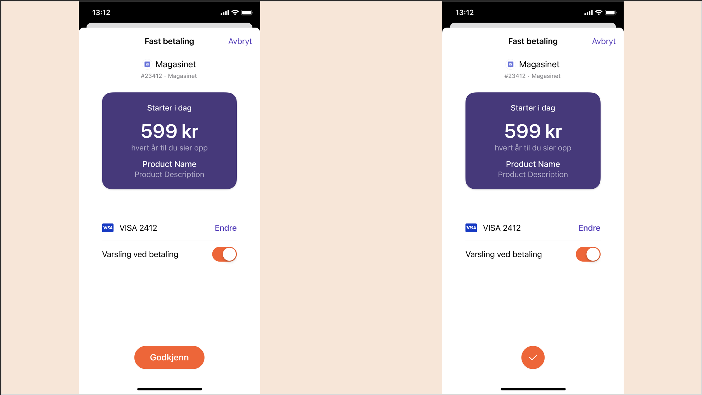

<!-- START_METADATA
---
title: "Vipps Login"
sidebar_position: 15
---
END_METADATA -->

# How Recurring works with Vipps Login

Vipps Login and Vipps Recurring can be used together making registration and payment simple for your customers.

For the complete API documentation go to

* [Vipps Login API](https://vippsas.github.io/vipps-developer-docs/docs/APIs/login-api)
* [Vipps Recurring API](https://vippsas.github.io/vipps-developer-docs/docs/APIs/recurring-api)

## The process

## 1. Buy a subscription

A user wants to buy a subscription on a merchant’s website or app.

## 2. Login with Vipps

The user logs in with Vipps on the merchant’s site.
If the user is remembered in browser the login will be completed directly in the browser. If not the user will be taken to the app to authenticate.

## 3. Confirm login

If the user needs to authenticate in the app, the user will be taken to Vipps to confirm the login.

## 4. Give consent to share information

If the user has not consented to sharing information with the merchant earlier the user needs to give this consent.
The user may click "See your information" to see the actual information that will be shared, but this is optional.

## 5. Logged in and ready to check out

This step is controlled and designed by the individual merchant. Typically, the user will now be logged in on the merchant’s page, and can proceed to set up the payment for the subscription. The information the user has shared with the merchant is automatically filled in. The merchant can also provide the user with the possibility to edit or add information if necessary.

## 6. Accept agreement in Vipps

The user accept the agreement in Vipps.

## 7. Subscription confirmed

The user is sent back to the merchant’s website or app, and the subscription is confirmed on the merchant’s site.

## Great! Now you know how you can use Vipps Login and Vipps Recurring together.

Take a look at the technical documentation in the
[Vipps Login API Guide](https://vippsas.github.io/vipps-developer-docs/docs/APIs/login-api),
and the
[Vipps Recurring API Guide](../vipps-recurring-api.md).
