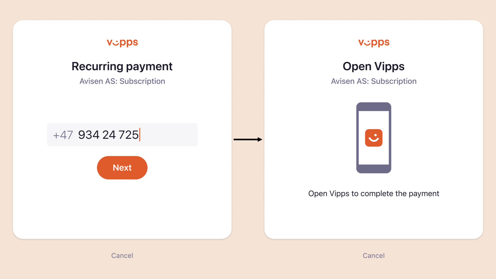
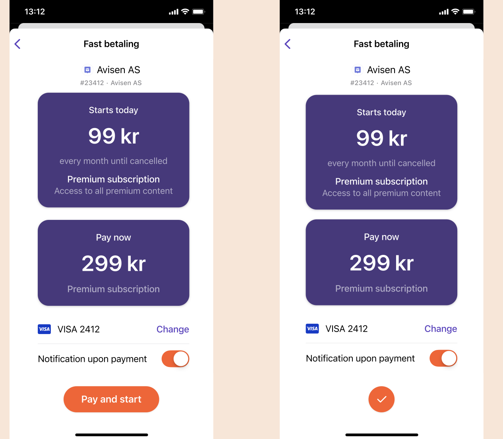
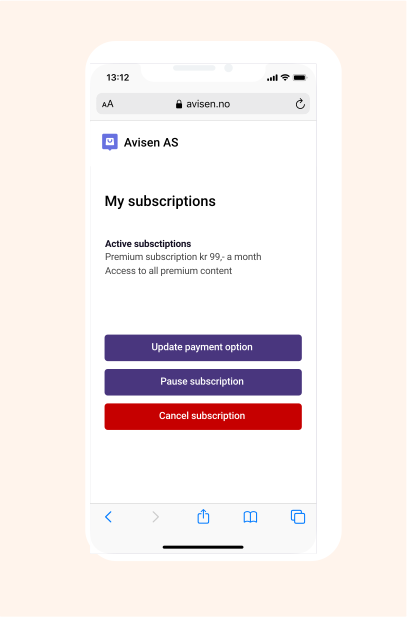

<!-- START_METADATA
---
title: How Recurring works with basic agreement
sidebar_label: Basic agreement
sidebar_position: 10
description: How Recurring works with basic agreement
pagination_next: null
pagination_prev: null
---
END_METADATA -->

# How Recurring works

<!-- START_COMMENT -->

ℹ️ Please use the website:
[Vipps MobilePay Technical Documentation](https://developer.vippsmobilepay.com/).

<!-- END_COMMENT -->

Recurring can be used for subscriptions, donations or other recurring payments.

For technical documentation go to:
[Recurring API](https://developer.vippsmobilepay.com/docs/APIs/recurring-api).

## The recurring payment process

## 1. Buy a subscription with Vipps MobilePay

A user chooses Vipps or MobilePay as payment method for a subscription on a merchant’s website or app.

## 2. The Vipps MobilePay landing page

If the agreement was started on a desktop device, the user will be sent to the Vipps MobilePay landing page.
The user confirms their number and is prompted to log in to Vipps or MobilePay.

If the agreement was started from a mobile device, the app will automatically switch over to Vipps or MobilePay.

## 3. Accept agreement in Vipps or MobilePay

The user receives a push notification on their phone. They log in to Vipps or MobilePay and accept the agreement.

If there is an initial charge to be paid, the user confirms the payment in this step as well.

## 4. Confirmation of subscription

The user is redirected back to the merchant’s website or app, and the subscription is confirmed on the merchant’s page.

Please note: Activation of the agreement is not guaranteed to be finished by the time the user is redirected back to the merchantRedirectUrl. The agreement could still have the status PENDING, so it is important to continue to poll the status of the agreement until a final status is returned by the API.

## 5. Overview of agreements and charges

The user can see their active subscriptions, as well as stopped subscriptions, and get an overview of previous charges in Vipps or MobilePay.

## 6. Manage agreements

If the user clicks on “Manage agreement” in the previous step, they will be sent to the merchant’s site where they can manage their subscriptions. We recommend using [Vipps Login](https://developer.vippsmobilepay.com/docs/APIs/login-api) to make login to the merchant’s site go smoothly.

## Great! Now you know how the Recurring payment process works.

Take a look at the technical documentation in the [Vipps Recurring API Guide](../vipps-recurring-api.md).
