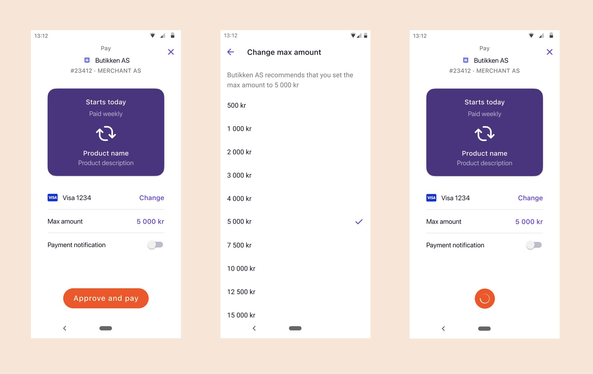
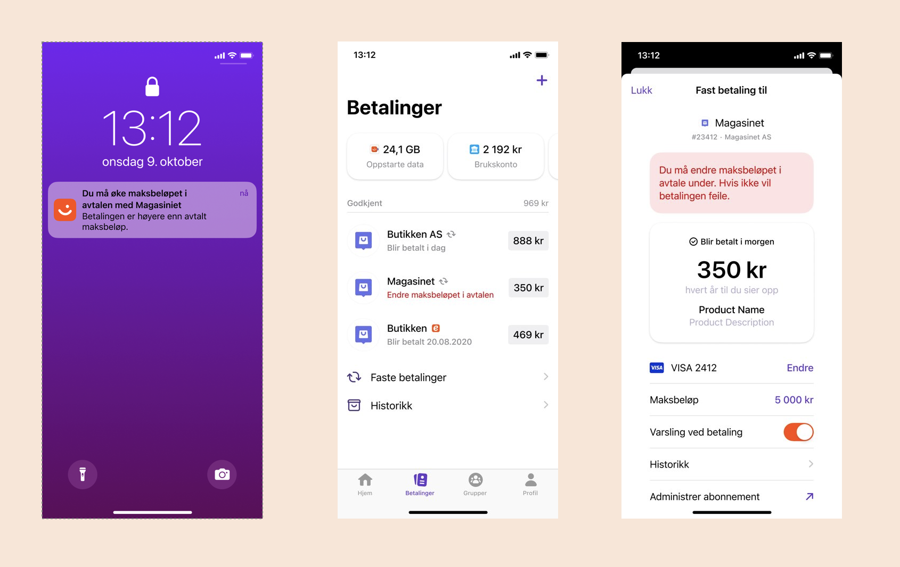
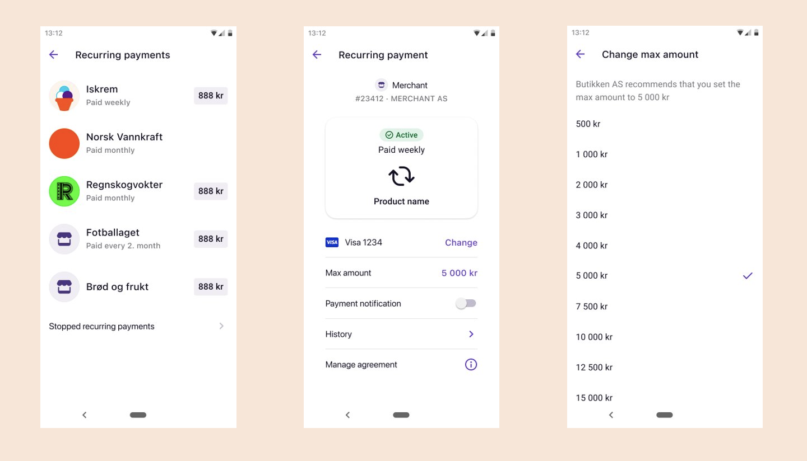

# How Recurring works with variable amount

For technical documentation go to:
[Vipps Recurring API](https://developer.vippsmobilepay.com/docs/APIs/recurring-api).

## Recurring variable amount pricing

## 1. Buy a subscription 

A user chooses Vipps or MobilePay as payment method for a subscription on a merchant's website or app. 

## 2. The landing page

If the agreement was started on a desktop device, the user will be sent to the Vipps MobilePay landing page.
The user confirms their number and is prompted to log in to Vipps or MobilePay.

If the agreement was started from a mobile device, the app will automatically switch over to Vipps or MobilePay.

## 3. Accept agreement 

The user receives a push notification on their phone. They log in to Vipps or MobilePay and accept the agreement.

If there is an initial charge to be paid, the user confirms the payment in this step as well.

In this step the user can choose the max amount that they will allow the merchant to charge each interval. 
The suggested amount from the merchant is preselected in the list.

## 5. Confirmation of subscription

The user is redirected back to the merchant’s website or app, and the subscription is confirmed on the merchant’s page.

## 6. Due charges

Upcoming charges is displayed in Vipps or MobilePay for the user to see.
If a charge fails for any reason and there is retry days left, a failure text is visible for the user on the charge.
This text will explain to the user what went wrong and how they can fix it.

### Extra notification if users max amount is too low

If the user has a lower max amount than the charge that is created, the user will get a push notification.
An explanation text is also shown on the charge in Vipps or MobilePay.

This notification and failure text is triggered and shown when the charge is set as due.

## 7. Overview and manage agreement

The user can see their active subscriptions, as well as stopped subscriptions, and get an overview of previous charges in Vipps or MobilePay.

If the user clicks on max amount, they can choose a new max amount for the agreement.

If the user clicks on `Manage agreement` (*Administrer abonnement*) in the previous step, they will be sent to the merchant’s site where they can manage their subscriptions. We recommend using [Vipps Login](https://developer.vippsmobilepay.com/docs/APIs/login-api) to make login to the merchant’s site go smoothly.

