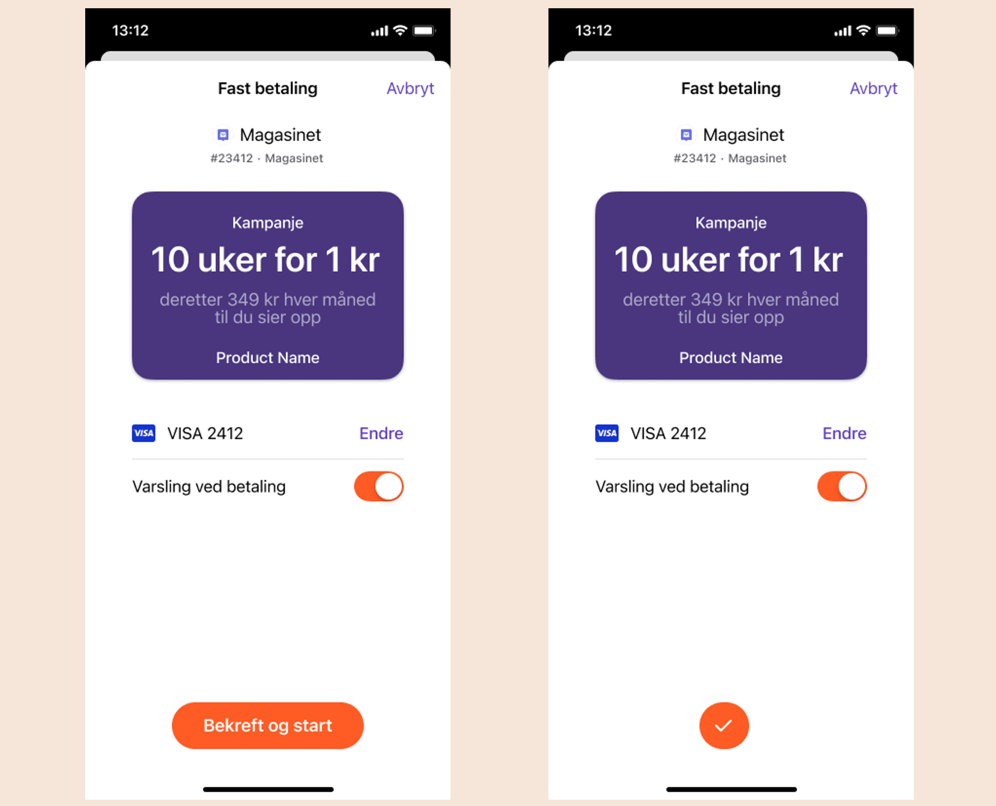

<!-- START_METADATA
---
title: How It Works: Campaigns
sidebar_position: 13
---
END_METADATA -->

# Vipps Recurring API with campaigns: How It Works

<!-- START_COMMENT -->

ℹ️ Please use the new documentation:
[Vipps Technical Documentation](https://vippsas.github.io/vipps-developer-docs/).

<!-- END_COMMENT -->

For technical documentation go to:
[Vipps Recurring API](https://vippsas.github.io/vipps-developer-docs/docs/APIs/recurring-api/).

## Recurring with campaign

## 1. Buy a subscription with Vipps

A user choose Vipps as payment method for a subscription on a merchant's website or app.

## 2. The Vipps landing page

If the agreement was started on a desktop device, the user will be sent to the Vipps landing page.
The user confirms their number and is prompted to log in to Vipps.

If the agreement was started from a mobile device, the app will automatically switch over to Vipps.

## 3. Accept agreement in Vipps

The user receives a push notification on their phone. They log in to Vipps and accept the agreement.

If there is an initial charge to be paid, the user confirms the payment in this step as well.

### Agreement with campaign

### Agreement with campaign and initial charge

## 4. Confirmation of subscription

The user is redirected back to the merchant’s website or app, and the subscription is confirmed on the merchant’s page.

## 5. Overview of agreements and charges

The user can see their active subscriptions, as well as stopped subscriptions, and get an overview of previous charges in Vipps.
Campaign information will be displayed on the active and stopped subscriptions until the campaign has expired. After that, the regular price and interval will be displayed.

### Agreement with running campaign

### Agreement after campaign as expired

## 6. Manage agreements

If the user clicks on “Manage agreement” in the previous step, they will be sent to the merchant’s site where they can manage their subscriptions. We recommend using [Vipps Login](https://vippsas.github.io/vipps-developer-docs/docs/APIs/login-api/) to make login to the merchant’s site go smoothly.

## Great! Now you know how the Vipps Recurring agreements with campaign process works.

## Questions?

We're always happy to help with code or other questions you might have!
Please create an [issue](https://github.com/vippsas/vipps-recurring-api/issues),
a [pull request](https://github.com/vippsas/vipps-recurring-api/pulls),
or [contact us](https://vippsas.github.io/vipps-developer-docs/docs/vipps-developers/contact).

Sign up for our [Technical newsletter for developers](https://vippsas.github.io/vipps-developer-docs/docs/vipps-developers/newsletters).
