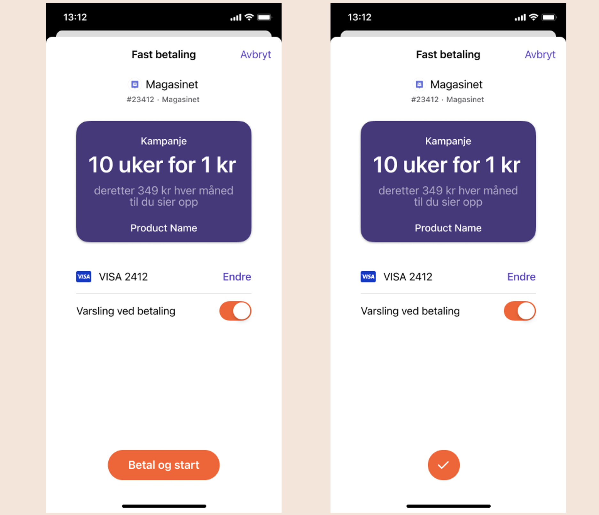

<!-- START_METADATA
---
title: How It Works: Initial charge
sidebar_position: 13
---
END_METADATA -->

# How It Works: Initial charge

<!-- START_COMMENT -->

ℹ️ Please use the new documentation:
[Vipps Technical Documentation](https://vippsas.github.io/vipps-developer-docs/).

<!-- END_COMMENT -->

## Introduction
The initial charge is used to require the user to pay an amount before the agreement is activated. Commonly this is set to the same amount as the agreement pricing (or the campaign price if applicable), but you can also set it to a larger amount in case they need to pay an additional fee, ie the discounted price of the phone if they purchase a smart phone with a subscription.

> <b>Note:</b> Initial charge can be used regardless of campaigns etc.

## Appearance
When the initial charge amount matches the agreement (or campaign) pricing, the initial charge is not explicitly displayed, but the buttons will say "Betal og start" instead of "Bekreft og start":
```json
{
  ...
  "initialCharge": {
     "amount": 100,
     "description": "Initial charge",
     "transactionType": "DIRECT_CAPTURE"
  },
  "pricing": {
    "amount": 34900,
    "currency": "NOK"
  },
  "campaign": {
    "type": "PERIOD_CAMPAIGN",
    "price": 100,
    "period": {
      "unit": "WEEK",
      "count": 10
    },
  },
  ...
}
```


If the amount is dissimilar, the initial charge will show up as a separate bubble instead:
```json
{
  ...
  "initialCharge": {
     "amount": 142900,
     "description": "Initial charge",
     "transactionType": "DIRECT_CAPTURE"
  },
  "pricing": {
    "amount": 34900,
    "currency": "NOK"
  },
  "campaign": {
    "type": "PERIOD_CAMPAIGN",
    "price": 100,
    "period": {
      "unit": "WEEK",
      "count": 10
    },
  },
  ...
}
```
