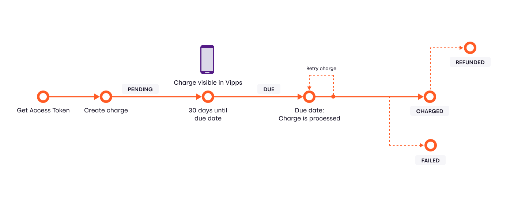

# Vipps Recurring API

API version: 1.0

The Vipps Recurring API delivers recurring payment functionality for a merchant
to create a payment agreement with a customer for fixed interval payments.
When the agreement is accepted by the end user the merchant can send charges
that will be automatically processed on the due date.

**IMPORTANT:** The Vipps Recurring API is available for existing customers that
have "Vipps på Nett" and a direct integration with the
[Vipps eCom API](https://github.com/vippsas/vipps-recurring-api)
and have completed some additional KYC checks required by Finanstilsynet.
Vipps is required to perform some extra compliance checks before
activating the Vipps Recurring API, please
[contact Vipps customer service](https://www.vipps.no/kontakt-oss/bedrift/vipps/)
to get access to the Recurring API in production.

Document version 2.1.0.

## Table of Contents

- [Vipps Recurring API](#vipps-recurring-api)
  - [Table of Contents](#table-of-contents)
  - [Terminology](#terminology)
  - [Flow diagram](#flow-diagram)
  - [Call by call guide](#call-by-call-guide)
    - [Vipps screenshots](#vipps-screenshots)
  - [API endpoints](#api-endpoints)
  - [Optional Vipps HTTP headers](#optional-vipps-http-headers)
  - [Agreements](#agreements)
    - [Create an agreement](#create-an-agreement)
    - [Accept an agreement](#accept-an-agreement)
    - [Intervals](#intervals)
    - [Initial charge](#initial-charge)
    - [Campaigns](#campaigns)
    - [Retrieve an agreement](#retrieve-an-agreement)
  - [Charges](#charges)
    - [Create a charge](#create-a-charge)
    - [Amount changes](#amount-changes)
    - [Charge descriptions](#charge-descriptions)
    - [Charge times](#charge-times)
    - [Charge retries](#charge-retries)
  - [Manage charges and agreements](#manage-charges-and-agreements)
    - [Agreement states](#agreement-states)
    - [Update an agreement](#update-an-agreement)
    - [Pause an agreement](#pause-an-agreement)
    - [Stop an agreement](#stop-an-agreement)
    - [Charge states](#charge-states)
  - [Userinfo](#userinfo)
    - [Scopes](#scopes)
    - [Userinfo call by call guide](#userinfo-call-by-call-guide)
    - [Example calls](#example-calls)
    - [Vipps Login access token](#vipps-login-access-token)
    - [Userinfo call](#userinfo-call)
    - [Consent](#consent)
  - [HTTP responses](#http-responses)
  - [Rate-limiting](#rate-limiting)
  - [Polling guidelines](#polling-guidelines)
  - [Timeouts](#timeouts)
    - [Using a phone](#using-a-phone)
    - [Using a laptop/desktop](#using-a-laptopdesktop)
  - [Authentication and authorization](#authentication-and-authorization)
  - [Recomendations regarding handling redirects](#recomendations-regarding-handling-redirects)
  - [Questions?](#questions)

## Terminology

| Term        |  Description                                    |
| ----------- | ----------------------------------------------- |
| Agreement   | A payment subscription with a set of parameters that a customer agrees to  |
| Charge      | A single payment within an agreement |
| Idempotency | The property of endpoints to be called multiple times without changing the result after the initial request. |

## Flow diagram

This diagram shows a simplified payment flow:


## Call by call guide

The normal "happy day" flow for a new agreement and a charge is:

1. Create a (draft) agreement:
   [`POST:/agreements`](https://vippsas.github.io/vipps-recurring-api/#/Agreement%20Controller/draftAgreement).
   The user can now confirm the agreement in Vipps.
   See [Create a new agreement](#create-a-new-agreement).
2. Retrieve the (hopefully approved) agreement:
   [`GET:/agreements/{agreementId}`](https://vippsas.github.io/vipps-recurring-api/#/Agreement%20Controller/getAgreement).
   See [Retrieve an agreement](#retrieve-an-agreement).
3. Create a charge for the agreement:
   [`POST:/agreements/{agreementId}/charges`](https://vippsas.github.io/vipps-recurring-api/#/Charge%20Controller/createCharge).
   See [Create a charge](#create-a-charge).
4. Capture the charge:
  [`POST:/v2/agreements/{agreementId}/charges/{chargeId}/capture`](https://vippsas.github.io/vipps-recurring-api/#/Charge%20Controller/captureCharge)  

**Note:** Vipps will *only* perform a payment transaction on an agreement when the merchant calls
[`POST:/agreements/{agreementId}/charges`](https://vippsas.github.io/vipps-recurring-api/#/Charge%20Controller/createCharge)
and
[`POST:/v2/agreements/{agreementId}/charges/{chargeId}/capture`](https://vippsas.github.io/vipps-recurring-api/#/Charge%20Controller/captureCharge).
Vipps does _not_ automatically perform payments. One reason for this is that the user may go to the "my page"
at the merchant to manage the agreement, and skip, postpone or otherwise change a payment.

You can also [Manage charges and agreements](#manage-charges-and-agreements).

That's the basics.
There is, of course, much more to this.
We have done our best to document everything about this API, and you _should_
have all information needed to integrate with Vipps.

### Vipps screenshots


## API endpoints

| Operation           | Description         | Endpoint          |
| -------------------- | ------------------- | ----------------- |
| [Create an agreement](#create-an-agreement)  | Create a new, draft agreement.  | [`POST:/agreements`](https://vippsas.github.io/vipps-recurring-api/#/Agreement%20Controller/draftAgreement)  |
| [Retrieve an agreement](#retrieve-an-agreement)  | Retrieve the details of an agreement.  |  [`GET:/v2/agreements/{agreementId}`](https://vippsas.github.io/vipps-recurring-api/#/Agreement%20Controller/getAgreement) |
| [Update an agreement]()   |  Update an agreement with new details. |  [`PATCH:/agreements/{agreementId}`](https://vippsas.github.io/vipps-recurring-api/#/Agreement%20Controller/updateAgreement) |
| [Stop an agreement](#stop-an-agreement) | Update the status to `STOPPED`.  | [`PATCH:/agreements/{agreementId}`](https://vippsas.github.io/vipps-recurring-api/#/Agreement%20Controller/updateAgreement)  |
| List all charges  | Get all charges for an agreement.  | [`GET:/v2/agreements/{agreementId}/charges`](https://vippsas.github.io/vipps-recurring-api/#/Charge%20Controller/listCharges)  |
| [Create a charge](#create-a-charge)   |  Create a new charge for an agreement. |  [`POST:/agreements/{agreementId}/charges`](https://vippsas.github.io/vipps-recurring-api/#/Charge%20Controller/createCharge) |
| Retrieve a charge  | Retrieve all details of a charge.  | [`GET:/v2/agreements/{agreementId}/charges/{chargeId}`](https://vippsas.github.io/vipps-recurring-api/#/Charge%20Controller/getCharge)  |
| Capture a charge  | Each charge must first be created, then captured.  | [`POST:/v2/agreements/{agreementId}/charges/{chargeId}/capture`](https://vippsas.github.io/vipps-recurring-api/#/Charge%20Controller/captureCharge)  |
| Cancel a charge | Cancel an existing charge before the user is charged. | [`DELETE:/agreements/{agreementId}/charges/{chargeId}`](https://vippsas.github.io/vipps-recurring-api/#/Charge%20Controller/cancelCharge) |
| Refund a charge    | Refund a charge that has been performed.   | [`POST:/agreements/{agreementId}/charges/{chargeId}/refund`](https://vippsas.github.io/vipps-recurring-api/#/Charge%20Controller/refundCharge)  |

See [Authentication and authorization](#authentication-and-authorization).

See the Postman collection available on https://github.com/vippsas/vipps-recurring-api
for en easy way to test the API.

## Authentication

All Vipps API calls are authenticated and authorized with an access token
(JWT bearer token) and an API subscription key:

| Header Name | Header Value | Description |
| ----------- | ------------ | ----------- |
| `Authorization` | `Bearer <JWT access token>` | Type: Authorization token. This is available on [portal.vipps.no](https://portal.vipps.no). |
| `Ocp-Apim-Subscription-Key` | Base 64 encoded string | The subscription key for this API. This is available on [portal.vipps.no](https://portal.vipps.no). |

For more information about how to obtain an access token and all details around this, please see:
[Quick overview of how to make an API call](https://github.com/vippsas/vipps-developers/blob/master/vipps-getting-started.md#quick-overview-of-how-to-make-an-api-call)
in the
[Getting started guide](https://github.com/vippsas/vipps-developers/blob/master/vipps-getting-started.md).

## Optional Vipps HTTP headers

We recommend using the following _optional_ HTTP headers for all requests to the
Vipps Recurring API. These headers provide useful metadata about the merchant's system,
which help Vipps improve our services, and also help in investigating problems.   

| Header                        | Description                                  | Example value        |
| ----------------------------- | -------------------------------------------- | -------------------- |
| `Merchant-Serial-Number`      | The merchant serial number                   | `123456`             |
| `Vipps-System-Name`           | The name of the ecommerce solution           | `woocommerce`        |
| `Vipps-System-Version`        | The version number of the ecommerce solution | `5.4`                |
| `Vipps-System-Plugin-Name`    | The name of the ecommerce plugin             | `vipps-woocommerce`  |
| `Vipps-System-Plugin-Version` | The version number of the ecommerce plugin   | `1.4.1`              |

These headers are required for plugins and partners and sent by the recent versions of
[the official Vipps plugins](https://github.com/vippsas/vipps-developers#plugins)
and we recommend all customers with direct integration with the API to also do so.

## Agreements

An agreement is between the Vipps user and the merchant.
Think of it as a subscription.
An agreement has payments, called charges.
See [Charges](#charges).

### Create an agreement

Create an agreement:
[`POST:/agreements`](https://vippsas.github.io/vipps-recurring-api/#/Agreement%20Controller/draftAgreement).

This code illustrates how to create an agreement:

[`POST:/agreements`](https://vippsas.github.io/vipps-recurring-api/#/Agreement%20Controller/draftAgreement)

```json
{
  "currency": "NOK",
  "customerPhoneNumber":"90000000",
  "interval": "MONTH",
  "intervalCount": 1,
  "isApp": false,
  "merchantRedirectUrl": "https://example.com/confirmation",
  "merchantAgreementUrl": "https://example.com/my-customer-agreement",
  "price": 49900,
  "productDescription": "Access to all games of English top football",
  "productName": "Premier League subscription"
}
```

The `merchantAgreementUrl` is a link to a "My page", where the customer
can manage the agreement: Change,  an, cancel, etc.
Vipps does not offer any form of agreement management, as this may be
quite complex operations, like changing subscription types,
temporary address change, etc.
The URL is opened in the standard web browser.

**Please note:** If the user closes Vipps before the redirect is done,
the `merchantRedirectUrl` will not be used. It is therefore impretant that you
actively check the payment with
[`GET:/v2/agreements/{agreementId}](https://vippsas.github.io/vipps-recurring-api/#/Agreement%20Controller/getAgreement).

The `merchantAgreementUrl` is just a normal link to a page where the customer
can log in and manage the agreement. We strongly recommend to use
[Vipps Logg Inn](https://www.vipps.no/produkter-og-tjenester/bedrift/logg-inn-med-vipps/logg-inn-med-vipps/)
so the user does not have to use a username and password, but is logged
in automatically through Vipps. See the
[API documentation](https://github.com/vippsas/vipps-login-api)
for more details.

The request parameters have the following size limits
(see
[`POST:/agreements`](https://vippsas.github.io/vipps-recurring-api/#/Agreement%20Controller/draftAgreement)
for more details):

* `productName`: Max length 45 characters
* `productDescription`: Max length 100 characters
* `price`: Greater than 100, meaning 1 NOK.

Agreements may be initiated with or without an [initial charge](#initial-charge),

The agreement price, and the amount for the initial charge, is given in øre,
the centesimal subdivision of the Norwegian kroner (NOK).
There are 100 øre in 1 krone.

| # | Agreement      | Description                                                                          |
|:--|:-----------|:-------------------------------------------------------------------------------------|
| 1 | `Agreement starting now`  | Agreement with an `initialcharge` that uses `DIRECT_CAPTURE` will only be `active` if the initial charge is processed successfully |
| 2 | `Agreement starting in future`  | Agreement without an `initialcharge`, or with `initialcharge` that uses `RESERVE_CAPTURE` can be approved but no payment will happen until the first charge is provided |

The response contains an `agreementResource`, a `vippsConfirmationUrl` and an `agreementId`.
This `agreementResource` is a complete URL for performing a
[`GET:/agreements/{agreementId}`](https://vippsas.github.io/vipps-recurring-api/#/Agreement%20Controller/getAgreement)
request.

The `vippsConfirmationUrl` should be used to redirect the
user to the Vipps landing page in a desktop flow (with `https://`),
or to Vipps in a mobile flow (with `vipps://`), where the
user can then approve the agreement.

### Accept an agreement

[`POST:/agreements`](https://vippsas.github.io/vipps-recurring-api/#/Agreement%20Controller/draftAgreement) will return the following JSON structure.

```json
{
  "vippsConfirmationUrl": "https://api.vipps.no/dwo-api-application/v1/deeplink/vippsgateway?v=2/token=eyJraWQiOiJqd3RrZXkiLCJhbGciOiJSUzI1NiJ9.eyJzdWIiOiJmMDE0MmIxYy02YjI",
  "agreementResource": "https://api.vipps.no-recurring/v2/agreements/agr_TGSuPyV",
  "agreementId": "agr_TGSuPyV"
}
```

The `vippsConfirmationUrl` should be used to redirect the user to the Vipps landing
page. The user can then confirm their identity, and receive a prompt to accept the
agreement within Vipps.

The `isApp` property can be used to receive a deeplink URL, which in a mobile context,
can be used to perform an app-switch, which removes the landing page step. This will only
work if the user has Vipps installed on the same device as they are initiating
the agreement from.

### Intervals

Intervals are defined with a interval type `MONTH`, `WEEK`, or `DAY` and frequency as a count.

Example for a bi-weekly subscription:
```json
"interval": "WEEK",
"intervalCount": 2,
```

Example for a quarterly subscription
```json
"interval": "MONTH",
"intervalCount": 3,
```

Example for a yearly subscription
```json
"interval": "MONTH",
"intervalCount": 12,
```

Example for a subscription every 100th day:
```json
"interval": "DAY",
"intervalCount": 100,
```

### Initial charge

Initial charge will be performed if the `initialcharge` is provided when
creating an agreement. Unlike regular (or `RECURRING`) charges, there is no
price limit on an `initialCharge`. This allows for products to be bundled with
agreements as one transaction (for example a phone). The user will be clearly
informed when an `initialCharge` is included in the agreement they are accepting.

See [Charge Titles](#charge-title) for explanation of how the charge description
is shown to the user.

The initial charge has two forms of transaction, `DIRECT_CAPTURE` and `RESERVE_CAPTURE`.  
See:
[What is the difference between "Reserve Capture" and "Direct Capture"?](https://github.com/vippsas/vipps-ecom-api/blob/master/vipps-ecom-api-faq.md#what-is-the-difference-between-reserve-capture-and-direct-capture)
in the eCom FAQ).

`DIRECT_CAPTURE` processes the payment immediately, while `RESERVE_CAPTURE`
reserves the payment for capturing at a later date. `RESERVE_CAPTURE` must be
used when selling physical goods bundled with an agreement - such as a phone
when subscribing to an agreement.

This example shows the same agreement as above, with an `initialCharge`
of 499 NOK:

```
{
  "currency": "NOK",
  "customerPhoneNumber":"90000000",
  "initialCharge": {
     "amount": 49900,
     "currency": "NOK",
     "description": "Premier League subscription",
     "transactionType": "DIRECT_CAPTURE"
  "interval": "MONTH",
  "intervalCount": 1,
  "isApp": false,
  "merchantRedirectUrl": "https://example.com/confirmation",
  "merchantAgreementUrl": "https://example.com/my-customer-agreement",
  "price": 49900,
  "productDescription": "Access to all games of English top football",
  "productName": "Premier League subscription"
}
```   

Change the `transactionType` field to `RESERVE_CAPTURE` to reserve the initial charge.

```json
"initialCharge": {
  "transactionType": "RESERVE_CAPTURE",
  "amount": 19900,
  "currency": "NOK",
  "description": "Phone"
},
```
A reserved charge can be captured with
[`POST:/agreements/{agreementId}/charges/{chargeId}/capture`](https://vippsas.github.io/vipps-recurring-api/#/Charge%20Controller/captureCharge)
when the product is shipped.

### Campaigns

A campaign in recurring is a period where the price is lower than usual, and
this is communicated to the customer with the original price shown for comparison.


In order to start a campaign the campaign field has to be added either to the agreement draft
[`POST:/agreements`](https://vippsas.github.io/vipps-recurring-api/#/Agreement%20Controller/draftAgreement)
for a campaign in the start of an agreement or update an agreement
[`PATCH:/agreements/{agreementId}`](https://vippsas.github.io/vipps-recurring-api/#/Agreement%20Controller/updateAgreement)
for an ongoing agreement. When adding a campaign
while drafting a new agreement the start date is ignored and the current
date-time is used. All dates must be in date-time format as according to
[RFC-3999](https://www.ietf.org/rfc/rfc3339.txt).

```json
"campaign": {
  "start": "2019-05-01T00:00:00Z",
  "end": "2019-06-01T00:00:00Z",
  "campaignPrice": 49900
}
```

| Field         | Description                                 |
| ------------------- | ------------------------------------------- |
| `start`            | Start date of campaign offer, if you are creating a agreement this is set to default now, and not an available variable  |
| `end`            | End date of campaign offer, can not be in the past |
| `campaignPrice`       | The price that will be shown for comparison   |


### Retrieve an agreement

A newly created agreement will be in status `PENDING` for 5 minutes before it expires.
If the customer approves the agreement, and the initialCharge (if provided) is successfully
processed, the agreement status will change to `ACTIVE`.

The approved agreement is retrieved from
[`GET:/agreements/{agreementId}`](https://vippsas.github.io/vipps-recurring-api/#/Agreement%20Controller/getAgreement)
with `"status":"ACTIVE"` when the customer has approved the agreement.

See [Agreement states](#agreement-states).

This is an example response from a call to
[`GET:/agreements/{agreementId}`](https://vippsas.github.io/vipps-recurring-api/#/Agreement%20Controller/getAgreement):

```json
{
  "id": "agr_5kSeqzFAMkfBbc",
  "start": "2018-08-22T13:00:00Z",
  "stop": null,
  "status": "ACTIVE",
  "productName": "Premier League subscription",
  "price": 49900,
  "productDescription": "Access to all games of English top football",
  "interval": "MONTH",
  "intervalCount": 1,
  "currency": "NOK",
  "campaign": null,
}
```

## Charges

An [agreement](#agreements) has payments, called charges.

### Create a charge

Charge the customer for each period with
[`POST:/agreements/{agreementId}/charges`](https://vippsas.github.io/vipps-recurring-api/#/Charge%20Controller/createCharge).

Each specific charge on an agreement must be scheduled by the merchant, a
minimum of two days before the payment will occur (it is minimum one day in the test environment).

Example: If the charge is _created_ on the 25th, the earliest the charge can be
_made_ is the 27th (25+2). This is so that the user can be informed about the
upcoming charge. The user is only shown one charge per agreement, in order to
not overwhelm the user when doing daily or weekly charges.

Create a charge for a given agreement. `due` will define for which date
the charge will be performed. This date has to be at a minimum two days in the
future (it is minimum one day in the test environment), and all charges `due` in
30 days or less are visible for users in Vipps.

An optional _and recommended_ `orderId` field can be set in the request.
If used this will be the id used to identify the charge throughout its payment
history, including in settlement files.

This `orderId` must be unique across all Recurring and eCom
transactions for the given `merchantSerialNumber`.
See
[orderId recommendations](https://github.com/vippsas/vipps-ecom-api/blob/master/vipps-ecom-api.md#orderid-recommendations).

If the field is not given a
unique id will be generated in the form `chr_xxxxxxx` (where each x is an alphanumeric
character). In settlements this autogenerated id is presented as `chrULxxxxxxx`.

### Amount changes

The `amount` of a charge is flexible and does not have to match the
`price` of the agreement.

A limit is in place however, which is 10 times the agreement `price` during the
span of the last `interval`. For example, in the
"Premier League subscription" agreement example above a limit of 4990 NOK (499 x 10)
over the last single `MONTH` period would be in place. If this limit becomes a
hindrance the agreement `price` can be [updated](#update-an-agreement).

**Note:** Although it is _technically_ possible to increase the price 10
times, we **strongly** recommend to be as user-friendly as possible, and
to make sure the user understands any changes and get updated information.

### Charge descriptions

When charges are shown to users in Vipps, they will have a title, and a
description. The title of a charge is derived directly from
`{agreement.ProductName}` whereas the description is set per charge, ie.
`{charge.description}`. For example, a charge on an agreement with product
name *Premier League subscription* with description *October* would look like
the following screenshot:


When the charge is processed, the payment will show up in the users's payment
history. In the payment history a charge from Vipps recurring payment will have
a description with follow format `{agreement.ProductName} - {charge.description}`.

[`POST:/agreements/{agreementId}/charges`](https://vippsas.github.io/vipps-recurring-api/#/Charge%20Controller/createCharge)
```json
{
  "amount": 49900,
  "currency": "NOK",
  "description": "October",
  "due": "2018-09-01",
  "retryDays": 5
}
```

**Note:** `description` cannot be longer than 45 characters.

### Charge times

Charge _attempts_ are made two times during the day: 08:00 and 16:00 UTC.  
This is the same both for our production and test environment.  
Subsequent attempts are made according to the `retryDays` specified.

### Charge retries

Vipps will retry the charge for the number of days specified in `retryDays`.

So if `retryDays=2` that would mean a maximum of 6 retries:
Two on the initial day, and two each for the subsequent days.

If `retryDays=0` it will try two times on the initial day.

Be aware that if you check the status of the charge within the retry period, it
might have status `FAILED`, also after the first attempt on the first and only day.

## Manage charges and agreements

It is the merchant's responsibility to manage and update charges and agreements,
and to use the API to make sure everything is in sync.

### Agreement states

| # | State      | Description                                                                          |
|:--|:-----------|:-------------------------------------------------------------------------------------|
| 1 | `PENDING`  | Agreement has been created, but not approved by the user in Vipps yet |
| 2 | `ACTIVE` | The agreement has been confirmed by the end user in Vipps and can receive charges |
| 3 | `STOPPED`  | Agreement has been stopped by the merchant most, typically when the end user wants to cancel the payment agreement |
| 4 | `EXPIRED` | The user did not accept, or failed to accept (due to processing an `initialCharge`), the agreement in Vipps |

### Update an agreement

A merchant can update an agreement by calling
[`PATCH:/agreements/{agreementId}`](https://vippsas.github.io/vipps-recurring-api/#/Agreement%20Controller/updateAgreement).
The following properties are available for updating:

```json
{
  "productName": "A new name",
  "productDescription": "A new description",
  "price": 25000,
  "status": "ACTIVE",
  "campaign": {
    "start": "2019-10-01T00:00:00Z",
    "end": "2019-12-01T00:00:00Z",
    "campaignPrice": 10000
  }
}
```

**Please note:** As a `PATCH` operation all parameters are optional. However
when setting an agreement status to `STOPPED` no other changes are allowed.
Attempts at changing other properties while stopping an agreement will result
in a `400 Bad Request` response.

### Pause an agreement

If there should be a pause in an agreement, like a temporary stop of a
subscription: Simply do not create any charges during the pause.

We recommended not to set the agreement status to `STOPPED`, but to update
the `productDescription` field of the agreement so the user can see that the
subscription is paused in Vipps.

### Stop an agreement

When a user notifies the merchant that they want to cancel a subscription or
service, the merchant must ensure that the status of the recurring agreement is
set to `STOPPED` at a suitable time.

We recommend that the recurring agreement remains `ACTIVE` for as long as the
user has access to the service. For example, if the user cancels their
subscription but they are still able to use the service until the end of the
billing cycle, the agreement should only be set to `STOPPED` at the end of the
billing cycle.  In this case we also recommend updating the `productDescription`
field of the agreement so that the user can see that the subscription is
cancelled or due to be cancelled at a given time.

Since `STOPPED` agreements cannot be reactivated, a benefit of waiting until
the "end of service" before setting the agreement status to `STOPPED` is that
the merchant will be able to reactivate the user's subscription without having
to set up a new agreement.

### Charge states



| # | State      | Description                                                                          |
|:--|:-----------|:-------------------------------------------------------------------------------------|
| 1 | `PENDING`  | The charge has been created, but has not yet been approved by the user. |
| 2 | `DUE`      | The charge is now visible in Vipps, and will be made in the next 30 days (this was previously 6). |
| 3 | `CHARGED`  | The charge has been completed. |
| 4 | `FAILED`   | The charge has failed for some reason, i.e. expired card, insufficient funds, etc. |
| 5 | `REFUNDED` | The charge has been refunded. The timeframe for issuing a refund is 365 days from the date of capture. |
| 6 | `PARTIALLY_REFUNDED`| A part of the captured amount has been refunded. |
| 7 | `RESERVED` | An initial charge with `transactionType` set to `RESERVE_CAPTURE` changes state to `CHARGED` when captured successfully. |
| 8 | `CANCELLED` | The charge has been cancelled. |
| 9 | `PROCESSING` | The charge is currently being processed by Vipps. |

## Userinfo

Vipps offers the possibility for merchants to ask for the user's profile
information as part of the payment flow. This is done by adding a `scope`
parameter to the initiate call:
[`POST:/recurring/v2/agreements`](https://vippsas.github.io/vipps-recurring-api/#/Agreement%20Controller/draftAgreement).

If the enduser has not already consented to sharing information from Vipps to the merchant the user will be asked for such consent before completing the payment flow. Once the payment flow is completed the merchant can get the profile information from our Userinfo endpoint. The Userinfo endpoint is shared with [Vipps login](https://github.com/vippsas/vipps-login-api) and the merchant needs to have activated Vipps login to use this feature.

To activate for Vipps Login - go to the developer section under https://portal.vipps.no and click "Setup login" for the desired account. When this is enabled, you get access to both Vipps login as a product, or fetching the users profileinfo can be used as standalone. If you are only using userinfo to fetch users profile info as part of a payment flow, you do not need to input redirect URIs when setting up login.

A users consent to share information with a merchant applies accross our services. Thus, if the merchant implements Vipps login in addition to profile information as part of the payment flow, the merchant can also use Vipps to log the user in without the need for additional consents.

### Scopes

| Scopes      | Description                                    | User consent required  |
| ------------| -----------------------------------------------|-------- |
| `address`     | List containing the user's addresses. Will always contain the home address, but can also include work and other.    |   yes   |
| `birthDate`   | Birth date (BankID verified)                               |   yes   |
| `email`       | Email address (verified), the flag "email_verified : true" in the response indicates whether the email address is verified                                   |   yes   |
| `name`        | First, middle and given name (verified with National Population Register)              |   yes   |
| `phoneNumber` | Phone number (verified - the number used when creating the Vipps account)                          |   yes   |
| `nin`        | Norwegian national identity number (verified with BankID). **NB:** Merchants need to apply for access to NIN. See: [Who can get access to NIN and how?](https://github.com/vippsas/vipps-login-api/blob/master/vipps-login-api-faq.md#who-can-get-access-to-nin-and-how) |   yes      |
| `accountNumbers` | User bank account numbers. **NB:** Merchants need to apply for access to accountNumbers. See: [Who can get access to account numbers and how?](https://github.com/vippsas/vipps-login-api/blob/master/vipps-login-api-faq.md#who-can-get-access-to-accountnumbers-and-how) |   yes      |

See the API specification for the formats and other details for each scope.

**Please note:** If the e-mail address that is delivered has the flag `email_verified : false`
this address should not be used to link the user to an existing account without
further authentication. Such authentication could be to prompt the user to
login to the original account or confirm the account linking by having a
confirmation link sent to the email address.

### Userinfo call by call guide

Scenario: You want to complete a payment and get the name and phone number of
a customer.

1. Retrieve the access token:
   [`POST:/accesstoken/get`](https://vippsas.github.io/vipps-recurring-api/#/Access%20Controller/getAccessToken).
2. Add scope to the transaction object and include the scopes you wish to get
   access to (valid scopes) before calling
   [`POST:/agreements`](https://vippsas.github.io/vipps-recurring-api/#/Agreement%20Controller/draftAgreement).
3. The user consents to the information sharing and perform the payment in Vipps.
4. Retrieve the `sub` by calling
   [`GET:/agreements/{agreementId}`](https://vippsas.github.io/vipps-recurring-api/#/Agreement%20Controller/getAgreement)
5. Generate an OAuth 2 access token with
   [`POST:/oauth2/token`](https://vippsas.github.io/vipps-login-api/#/Vipps%20Log%20In%20API/oauth2Token),
   using the `clientId:client_secret` as base64 as described in
   [Vipps Login access token](#vipps-login-access-token),
   with the `grant_type` set to `"client_credentials"`.
6. Using the access token from step 5, call
   [`GET:/vipps-userinfo-api/userinfo/{sub}`](https://vippsas.github.io/vipps-login-api/#/Vipps%20Log%20In%20API/userinfo)
   to retrieve the user's information.

**Important note:** The API call to
[`GET:/vipps-userinfo-api/userinfo/{sub}`](https://vippsas.github.io/vipps-login-api/#/Vipps%20Log%20In%20API/userinfo)
must _not_ include the subscription key used for the Recurring API as Login
is _not_ under the same subscription, and will result in a
`HTTP Unauthorized 401` error.

### Example calls

To request these scopes add the scopes to the initial call to
[`POST:​/v2​/agreements`](https://vippsas.github.io/vipps-recurring-api/#/Agreement%20Controller/draftAgreement)

Example of request with scope:

```json
{
  "currency": "NOK",
  "customerPhoneNumber":"90000000",
  "interval": "MONTH",
  "intervalCount": 1,
  "isApp": false,
  "merchantRedirectUrl": "https://example.com/confirmation",
  "merchantAgreementUrl": "https://example.com/my-customer-agreement",
  "price": 49900,
  "productDescription": "Access to all games of English top football",
  "productName": "Premier League subscription",
  "scope": "address name email birthDate phoneNumber"
}
```

The user then consents and pays in Vipps.

**Please note:** This operation has an all or nothing approach, a user must
complete a valid agreement and consent to all values in order to complete the
session. If a user chooses to reject the terms the payment will not be
processed. Unless the whole flow is completed, this will be handled as regular
a failed agreement by the recurring APIs

Once the user completes the session a unique identifier `sub` can be retrieved in the agreement details
[`GET:/v2/agreements/{agreementId}`](https://vippsas.github.io/vipps-recurring-api/#/Agreement%20Controller/getAgreement) endpoint alongside the full URL to Userinfo.

Example `sub` and `userinfoUrl` format:

```json
"sub": "c06c4afe-d9e1-4c5d-939a-177d752a0944",
"userinfoUrl": "https://api.vipps.no/vipps-userinfo-api/userinfo/c06c4afe-d9e1-4c5d-939a-177d752a0944"
```

This `sub` is a link between the merchant and the user and can used to retrieve
the user's details from Vipps Login:
[`GET:/vipps-userinfo-api/userinfo/{sub}`](https://vippsas.github.io/vipps-login-api/#/Vipps%20Log%20In%20API/userinfo)

**Please note:** It is recommended to get the user's information directly after completing the transaction. There is a however a **time limit of 168 hours** (one week) to retrieve the consented profile data from the userinfo endpoint to better support merchants that depend on manual steps/checks in their process of fetching the profile data. The merchant will get the information that is in the user profile at the time when they actually fetch the information. This means that the information might have changed from the time the user completed the transaction and the fetching of the profile data.

### Vipps Login access token

Accessing the Login `userinfo` endpoint required the Vipps Login access token: [`POST:/oauth2/token`](https://vippsas.github.io/vipps-login-api/#/Vipps%20Log%20In%20API/oauth2Token). The client constructs the request by adding the parameters described below to the HTTP body by using the `application/x-www-form-urlencoded` format.

**Request**

*Headers*

| Header            | Description                           |
| ----------------- | ------------------------------------- |
| Content-Type      | "application/x-www-form-urlencoded"   |
| Authorization     | "Basic {Client Credentials}"          |

The Client Credentials is a base 64 encoded string consisting of the Client id
and secret issued by Vipps joined by ":"

Example of generating the client credentials in bash where:

- client_id = 123456-test-4a3d-a47c-412136fd0871
- client_secret = testdzlJbUZaM1lqODlnUUtrUHI=

```bash
echo "123456-test-4a3d-a47c-412136fd0871:testdzlJbUZaM1lqODlnUUtrUHI=" | base64
```

Which results in the base64 client secret: `MTIzNDU2LXRlc3QtNGEzZC1hNDdjLTQxMjEzNmZkMDg3MTp0ZXN0ZHpsSmJVWmFNMWxxT0RsblVVdHJVSEk9Cg==`

*Form content*

| Key               | Description                         |
| ----------------- | ----------------------------------- |
| grant_type        | Value **must** be the actual string  `"client_credentials"`, not the value generated above.  |

**Example response:**

```json
{
  "access_token": "hel39XaKjGH5tkCvIENGPNbsSHz1DLKluOat4qP-A4.WyV61hCK1E2snVs1aOvjOWZOXOayZad0K-Qfo3lLzus",
  "id_token": "eyJhbGciOiJSUzI1NiIsImtpZCI6InB1YmxpYzo4MGYzYzM0YS05Nzc5LT <snip>",
  "expires_in": 3599,
  "scope": "openid",
  "token_type": "bearer"
}
```

### Userinfo call

This endpoint returns the payload with the information that the user has consented to share, which is provided in the OAuth 2.0 access token.
You can learn more at the [OIDC Standard](https://openid.net/specs/openid-connect-core-1_0.html#UserInfo).

Call [`GET:/vipps-userinfo-api/userinfo/{sub}`](https://vippsas.github.io/vipps-login-api/#/Vipps%20Log%20In%20API/userinfo) with the `sub` that was retrieved when calling [`GET:/v2/agreements/{agreementId}`](https://vippsas.github.io/vipps-recurring-api/#/Agreement%20Controller/getAgreement). See below on how to construct the call.

**Request**

*Headers*

| Header            | Description                            |
| ----------------- | -------------------------------------  |
| Authorization     | "Bearer {Access Token}"                |

The access token is received on a successful request to the token endpoint described above.

**Example response:**

```json
{
    "sub": "c06c4afe-d9e1-4c5d-939a-177d752a0944",
    "birthdate": "1815-12-10",
    "email": "user@example.com",
    "email_verified": true,
    "nin": "10121550047",
    "name": "Ada Lovelace",
    "given_name": "Ada",
    "family_name": "Lovelace",
    "sid": "7d78a726-af92-499e-b857-de263ef9a969",
    "phone_number": "4712345678",
    "address": {
        "street_address": "Suburbia 23",
        "postal_code": "2101",
        "region": "OSLO",
        "country": "NO",
        "formatted": "Suburbia 23\\n2101 OSLO\\nNO",
        "address_type": "home"
    },
    "other_addresses": [
        {
            "street_address": "Fancy Office Street 2",
            "postal_code": "0218",
            "region": "OSLO",
            "country": "NO",
            "formatted": "Fancy Office Street 2\\n0218 OSLO\\nNO",
            "address_type": "work"
        },
        {
            "street_address": "Summer House Lane 14",
            "postal_code": "1452",
            "region": "OSLO",
            "country": "NO",
            "formatted": "Summer House Lane 14\\n1452 OSLO\\nNO",
            "address_type": "other"
        }
    ],
    "accounts": [
        {
            "account_name": "My savings",
            "account_number": "12064590675",
            "bank_name": "My bank"
        }
    ]
}
```

**Please note:** More documentation about the token and userinfo endpoint can be found [here](https://github.com/vippsas/vipps-login-api/blob/master/vipps-login-api.md#access-token).


### Consent

A user's consent to share information with a merchant applies across all Vipps
services. Thus, if the merchant implements Vipps Login in addition to profile
information as part of the agreement flow, the merchant can also use Vipps to
log the user in without the need for additional consent.

The user is presented with a consent card that must be accepted before
approving the agreement in Vipps. The following screens shows examples
of consent cards for Android(left) and iOS(right):


**Please note:** This operation has an "all or nothing" approach, so a user must accept the agreement and consent to _all_ values in order to complete the
session. If a user chooses to reject the terms the agreement will not be
activated. Unless the whole flow is completed, this will be handled as a
failed agreement by the Recurring API.

## HTTP responses

This API returns the following HTTP statuses in the responses:

| HTTP status                 | Description                                 |
| --------------------------- | ------------------------------------------- |
| `200 OK`                    | Request successful                          |
| `201 Created`               | Request successful, resource created        |
| `400 Bad Request`           | Invalid request, see the error for details  |
| `401 Unauthorized`          | Invalid credentials                         |
| `403 Forbidden`             | Authentication ok, but credentials lacks authorization  |
| `404 Not Found`             | The resource was not found                  |
| `409 Conflict`              | Unsuccessful due to conflicting resource    |
| `422 Unprocessable Entity`  | Vipps could not process                     |
| `429 Too Many Requests`     | Look at [table below to view current rate limits](#rate-limiting)   |
| `500 Server Error`          | An internal Vipps problem.                  |

All error responses contains an `error` object in the body, with details of the
problem.

## Rate-limiting

We have added rate-limiting to our API (`HTTP 429 Too Many Requests`) to prevent
fraudulent and wrongful behaviour, and increase the stability and security of
our API. The limits should not affect normal behaviour, but please contact us
if you notice any unexpected behaviour.

| API                                                                                                      | Limit          | Key used                                          |
|----------------------------------------------------------------------------------------------------------|----------------|---------------------------------------------------|
| [CreateCharge](https://vippsas.github.io/vipps-recurring-api/#/Charge%20Controller/createCharge)         | 2 per minute   | agreementId + chargeId (based on idempotency key) |
| [CancelCharge](https://vippsas.github.io/vipps-recurring-api/#/Charge%20Controller/cancelCharge)         | 5 per minute   | agreementId + chargeId                            |
| [CaptureCharge](https://vippsas.github.io/vipps-recurring-api/#/Charge%20Controller/captureCharge)       | 5 per minute   | agreementId + chargeId                            |
| [RefundCharge](https://vippsas.github.io/vipps-recurring-api/#/Charge%20Controller/refundCharge)         | 5 per minute   | agreementId + chargeId                            |
| [ListAgreements](https://vippsas.github.io/vipps-recurring-api/#/Agreement%20Controller/listAgreements)  | 5 per minute   | (per merchant)                                    |
| [UpdateAgreement](https://vippsas.github.io/vipps-recurring-api/#/Agreement%20Controller/updateAgreement)| 5 per minute   | agreementId                                       |
| [FetchCharge](https://vippsas.github.io/vipps-recurring-api/#/Charge%20Controller/getCharge)             | 10 per minute  | agreementId + chargeId                            |
| [ListCharges](https://vippsas.github.io/vipps-recurring-api/#/Charge%20Controller/listCharges)           | 10 per minute  | agreementId                                       |
| [FetchAgreement](https://vippsas.github.io/vipps-recurring-api/#/Agreement%20Controller/getAgreement)    | 120 per minute | agreementId                                       |
| [DraftAgreement](https://vippsas.github.io/vipps-recurring-api/#/Agreement%20Controller/draftAgreement)  | 300 per minute | (per merchant)                                    |

## Polling guidelines

General guidelines for When to start polling with
[`GET:/v2/agreements/{agreementId}`](https://vippsas.github.io/vipps-recurring-api/#/Agreement%20Controller/getAgreement):

1. Start after 5 seconds
2. Check every 2 seconds

These are reasonable values, but different merchants have different use cases,
and values should be adapted to the specific case.

See [Timeouts](#timeouts) for details about timeouts.

## Timeouts

### Using a phone

Both the deeplink URL, which causes the app-switch to Vipps, and the landing
page displayed in browsers, is valid for 5 minutes.

If the user does not act on the app-switch (such as not attempting to log into
Vipps) within 5 minutes, the payment times out.

After the app-switch to Vipps, the user has another 5 minutes to complete the
payment in Vipps.

This means that the user has a total of 10 minutes to complete the payment.

### Using a laptop/desktop

If the user is using a laptop/desktop device, and the user must confirm or
enter the phone number on the landing page within 5 minutes.
If the user does not do so, the payment times out.

After the user has clicked "OK" on the landing page, the user
has an additional 5 minutes to complete the payment in Vipps.

This means that the user has a total of 10 minutes to complete the payment.

## Authentication and authorization

All Vipps API requests must include an `Authorization` header with
a JSON Web Token (JWT), which we call the _access token_.
The access token is obtained by calling
[`POST:/accesstoken/get`](https://vippsas.github.io/vipps-ecom-api/#/Authorization_Service/fetchAuthorizationTokenUsingPost)
and passing the `client_id`, `client_secret` and `Ocp-Apim-Subscription-Key`.

See [Get an access token](https://github.com/vippsas/vipps-developers/blob/master/vipps-getting-started.md#get-an-access-token)
in the
[Getting started guide](https://github.com/vippsas/vipps-developers/blob/master/vipps-getting-started.md)
for more information.

## Recomendations regarding handling redirects

Since Vipps is a mobile entity the amount of control Vipps have over the redirect back to the merchant after the purchase is completed is limited. A merchant must not assume that Vipps will redirect to the exact same session and for example rely entirely on cookies in order to handle the redirect event. For example the redirect could happen to another browser.

Examples of some, but not all, factors outside of Vipps control.
- Configurations set by the OS itself, for example the default browser.
- User configurations of browsers.
- Users closing app immediately upon purchase.

Therefore Vipps recommends having a stateless approach in the site that is supposed to be the end session. An example would a polling based result handling from a value in the redirect url.

Example for demonstration purposes that should be handled.

- User starts is in web session in a Chrome Browser.
- A Vipps purchase is started, a redirect URL is defined by the Merchant.
- The user completes the purchase.
- The Vipps app redirects the user.
- The OS defaults to a Safari Browser for the redirect.
- The merchant handles the redirect without the customer noticing any discrepancies from the browser switch.

## Questions?

We're always happy to help with code or other questions you might have!
Please create an [issue](https://github.com/vippsas/vipps-recurring-api/issues),
a [pull request](https://github.com/vippsas/vipps-recurring-api/pulls),
or [contact us](https://github.com/vippsas/vipps-developers/blob/master/contact.md).

Sign up for our [Technical newsletter for developers](https://github.com/vippsas/vipps-developers/tree/master/newsletters).
