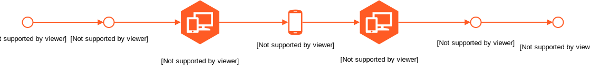
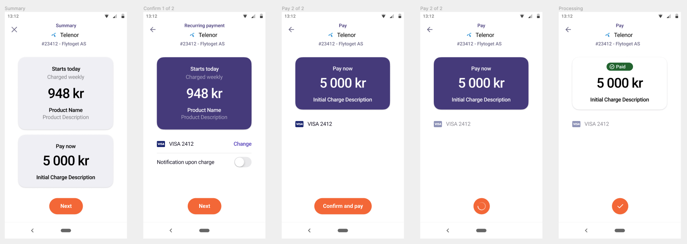
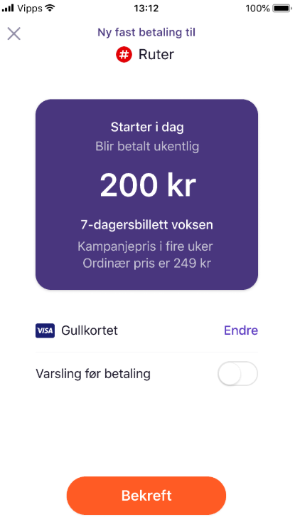
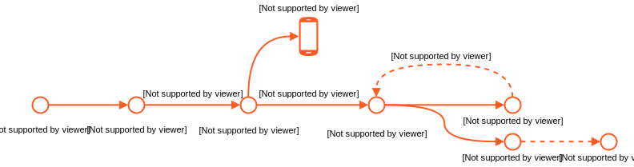

# Vipps Recurring API

The Vipps Recurring API delivers recurring payment functionality for a merchant
to create a payment agreement with a customer for fixed interval payments.
When the agreement is accepted by the end user the merchant can send charges
that will be automatically processed on the due date.

If you have an issues or suggestions please
create an [issue](https://github.com/vippsas/vipps-recurring-api/issues)
or a [pull request](https://github.com/vippsas/vipps-recurring-api/pulls).
If it is a critical issue, or involves sensitive information please
[contact us directly](https://github.com/vippsas/vipps-developers/blob/master/contact.md).

**API documentation:** https://vippsas.github.io/vipps-recurring-api/

**Terminology**

| Term |  Description                                    |
|:-----|:----------------------------------------------- |
| Agreement         | A payment subscription with a set of parameters that a customer agrees to  |
| Charge         | A single payment within an agreement |
| Idempotency | The property of endpoints to be called multiple times without changing the result after the initial request. |
# Table of Contents

- [How to perform recurring payments](#how-to-perform-recurring-payments)
  * [Vipps screenshots](#vipps-screenshots)
  * [Step 1: Draft an agreement](#step-1--draft-an-agreement)
    + [Initial charge](#initial-charge)
    + [Campaigns](#campaigns)
  * [Step 2: Retrieve the approved agreement](#step-2--retrieve-the-approved-agreement)
    + [Pausing an agreement](#pausing-an-agreement)
  * [Step 3: Create a charge](#step-3--create-a-charge)
    + [Charge title](#charge-title)
    + [Charge times](#charge-times)
    + [Charge retries](#charge-retries)
  * [Step 4: Manage charges and agreements](#step-4--manage-charges-and-agreements)
    + [Agreement states](#agreement-states)
    + [Charge states](#charge-states)
    + [Updating an Agreement](#updating-an-agreement)
    + [Agreement life cycle recommendation](#Agreement-life-cycle-recommendations)
- [HTTP responses](#http-responses)
- [Authentication and authorization - API access token](#authentication-and-authorization---api-access-token)
- [Questions?](#questions-)

# How to perform recurring payments



1. Draft a new agreement to be approved with [`POST:/agreements`](https://vippsas.github.io/vipps-recurring-api/#/Agreement%20Controller/draftAgreement). The response contains an `agreementResource`, a `vippsConfirmationUrl` and an `agreementId`. This `agreementResource` is a complete URL for performing a [`GET:/agreements/{agreementId}`](https://vippsas.github.io/vipps-recurring-api/#/Agreement%20Controller/getAgreement) request. The `vippsConfirmationUrl` should be used to redirect the user to the Vipps landing page on a Desktop flow, or Vipps app in a mobile flow. Where the user can then approve the agreement.

2. The approved agreement is retrieved from [`GET:/agreements/{agreementId}`](https://vippsas.github.io/vipps-recurring-api/#/Agreement%20Controller/getAgreement) with `"status":"ACTIVE"` when customer has approved the agreement.

3. Charge the customer for each period with [`POST:/agreements/{agreementId}/charges`](https://vippsas.github.io/vipps-recurring-api/#/Charge%20Controller/createCharge).<br>
Each specific charge on an agreement must be scheduled by the merchant, a minimum of two days before the payment will occur. <br>
**Note:** Vipps will *only* perform a payment transaction on an agreement after being told by the merchant through this endpoint.

4. Manage charges and agreements with:  
* [`DELETE:/agreements/{agreementId}/charges/{chargeId}`](https://vippsas.github.io/vipps-recurring-api/#/Charge%20Controller/cancelCharge)  
* [`POST:/agreements/{agreementId}/charges/{chargeId}/refund`](https://vippsas.github.io/vipps-recurring-api/#/Charge%20Controller/refundCharge)  
* [`PATCH:/agreements/{agreementId}`](https://vippsas.github.io/vipps-recurring-api/#/Agreement%20Controller/updateAgreement)

## Vipps screenshots



## Step 1: Draft an agreement

The following code illustrates how to create an agreement:

[`POST:/agreements`](https://vippsas.github.io/vipps-recurring-api/#/Agreement%20Controller/draftAgreement)
```json
{
  "currency": "NOK",
  "customerPhoneNumber":"90000000",
  "interval": "MONTH",
  "intervalCount": 1,
  "isApp": false,
  "merchantRedirectUrl": "https://example.com/confirmation",
  "merchantAgreementUrl": "https://example.com/my-customer-agreement",
  "price": 49900,
  "productDescription": "Access to all games of English top football",
  "productName": "Premier League subscription"
}
```

The `merchantAgreementUrl` is a link to a "My page", where the customer
can manage the agreement: Change, pause, cancel, etc.

The request parameters have the following size limits
(see
[`POST:/agreements`](https://vippsas.github.io/vipps-recurring-api/#/Agreement%20Controller/draftAgreement)
for more details):
* `productName`: Max length 45 characters
* `productDescription`: Max length 100 characters
* `price`: Greater than 100

Agreements may be initiated with or without an [initial charge](#initial-charge),

The agreement price, and the amount for the initial charge, is given in øre,
the centesimal subdivision of the Norwegian kroner (NOK).
There are 100 øre in 1 krone.

| # | Agreement      | Description                                                                          |
|:--|:-----------|:-------------------------------------------------------------------------------------|
| 1 | `Agreement starting now`  | Agreement with an `initialcharge` that uses `DIRECT_CAPTURE` will only be `active` if the initial charge is processed successfully |
| 2 | `Agreement starting in future`  | Agreement without an `initialcharge`, or with `initialcharge` that uses `RESERVE_CAPTURE` can be approved but no payment will happen until the first charge is provided |

**Accepting the agreement**

[`POST:/agreements`](https://vippsas.github.io/vipps-recurring-api/#/Agreement%20Controller/draftAgreement) will return the following JSON structure.

```json
{
  "vippsConfirmationUrl": "https://api.vipps.no/dwo-api-application/v1/deeplink/vippsgateway?v=2/token=eyJraWQiOiJqd3RrZXkiLCJhbGciOiJSUzI1NiJ9.eyJzdWIiOiJmMDE0MmIxYy02YjI",
  "agreementResource": "https://api.vipps.no-recurring/v2/agreements/agr_TGSuPyV",
  "agreementId": "agr_TGSuPyV"
}
```

The `vippsConfirmationUrl` should be used to redirect the user to the Vipps landing
page. The user can then confirm their identity, and recieve a prompt to accept the
agreement within the Vipps app.

The `isApp` property can be used to receive a Deeplink URL, which in a mobile context,
can be used to perform an App Switch, which removes the landing page step. This will only
work if the user has the Vipps App installed on the same device as they are initiating
the agreement from.

**Intervals**

Intervals are defined with a interval type `MONTH`, `WEEK`, or `DAY` and frequency as a count.

Example for a bi-weekly subscription:
```json
"interval": "WEEK",
"intervalCount": 2,
```

Example for a quarterly subscription
```json
"interval": "MONTH",
"intervalCount": 3,
```

Example for a yearly subscription
```json
"interval": "MONTH",
"intervalCount": 12,
```

### Initial charge
Initial charge will be performed if the `initialcharge` is provided when creating an agreement.
Unlike regular (or `RECURRING`) charges, there is no price limit on an `initialCharge`. This
allows for products to be bundled with agreements as one transaction (for example a phone). The user
will be clearly informed when an `initialCharge` is included in the agreement they are accepting.

See [Charge Titles](#charge-title) for explanation of how the charge description is shown to the user.

The initial charge has two forms of transaction, `DIRECT_CAPTURE` and `RESERVE_CAPTURE`.  

`DIRECT_CAPTURE` processes the payment imediately, while `RESERVE_CAPTURE` reserves the payment for capturing at a later date,
this must be used when selling phyisical goods bundled with an agreement. Such as a phone, when subscribing to a agreement for example.

This example shows the same agreement as above, with an `initialCharge`
of 499 NOK:

```
{
  "currency": "NOK",
  "customerPhoneNumber":"90000000",
  "initialCharge": {
     "amount": 49900,
     "currency": "NOK",
     "description": "Premier League subscription",
     "transactionType": "DIRECT_CAPTURE"
  "interval": "MONTH",
  "intervalCount": 1,
  "isApp": false,
  "merchantRedirectUrl": "https://example.com/confirmation",
  "merchantAgreementUrl": "https://example.com/my-customer-agreement",
  "price": 49900,
  "productDescription": "Access to all games of English top football",
  "productName": "Premier League subscription"
}
```   

Change the `transactionType` field to `RESERVE_CAPTURE` to reserve the initial charge.
```json
"initialCharge": {
  "transactionType": "RESERVE_CAPTURE",
  "amount": 19900,
  "currency": "NOK",
  "description": "Phone"
},
```
A reserved charge can be captured with [`POST:/agreements/{agreementId}/charges/{chargeId}/capture`](https://vippsas.github.io/vipps-recurring-api/#/Charge%20Controller/captureCharge) when the product is shipped.

### Campaigns
A campaign in recurring is a period where the price is lower than usual, and
this is communicated to the customer with the original price shown for comparison.



In order to start a campaign the campaign field has to be added either to the agreement draft [`POST:/agreements`](https://vippsas.github.io/vipps-recurring-api/#/Agreement%20Controller/draftAgreement) for a campaign in the start of an agreement or update an agreement [`PATCH:/agreements/{agreementId}`](https://vippsas.github.io/vipps-recurring-api/#/Agreement%20Controller/updateAgreement) for an ongoing agreement. When adding a campaign
while drafting a new agreement the start date is ignored and the current date-time is used. All dates must be in date-time format as according to [RFC-3999](https://www.ietf.org/rfc/rfc3339.txt).

```json
"campaign": {
  "start": "2019-05-01T00:00:00Z",
  "end": "2019-06-01T00:00:00Z",
  "campaignPrice": 49900
}
```

| Field         | Description                                 |
| ------------------- | ------------------------------------------- |
| `start`            | Start date of campaign offer, if you are creating a agreement this is set to default now, and not an available variable  |
| `end`            | End date of campaign offer, can not be in the past |
| `campaignPrice`       | The price that will be shown for comparison   |


## Step 2: Retrieve the approved agreement
The agreement will be in status `PENDING` for 5 minutes before it expires.
If the customer approves the agreement, and the initialCharge (if provided) is successfully
processed, the agreement status will change to `active`.

[`GET:/agreements/{agreementId}`](https://vippsas.github.io/vipps-recurring-api/#/Agreement%20Controller/getAgreement)
```json
{
  "id": "agr_5kSeqzFAMkfBbc",
  "start": "2018-08-22T13:00:00Z",
  "stop": null,
  "status": "ACTIVE",
  "productName": "Premier League subscription",
  "price": 49900,
  "productDescription": "Access to all games of English top football",
  "interval": "MONTH",
  "intervalCount": 1,
  "currency": "NOK",
  "campaign": null,
}
```
### Pausing an agreement
If there should be a pause in an agreement, like a temporary stop of a
subscription: Simply do not create any charges during the pause.

## Step 3: Create a charge
Create a charge for a given agreement. `due` will define for which date
the charge will be performed. This date has to be at a minimum two days in the future. The `amount` of a charge is flexible and does not
have to match the `price` of the agreement.

A limit is in place however, which is 10 times the agreement `price` during the span of the last `interval`.
For example, in the agreement [above](#step-2-retrieve-the-approved-agreement) a limit of 4990NOK over the last
single `MONTH` period would be in place. If this limit becomes a hindrance the agreement `price` can be
[updated](#updating-an-agreement).

An optional `orderId` field can be set in the request, if used this will be the id used to identify the charge
throughout its payment history, including in settlement files. This `orderId` must be unique across all Recurring
and eCom transactions for the given `merchantSerialNumber`. If the field is not given a unique id will be generated
in the form `chr_xxxxxxx` (where x is a alphanumeric character). In settlements this auto generated Id is presented as
`chrULxxxxxxx`.

### Charge title
The title of the charge shown to a user in the Vipps app is in the format `{agreement.ProductName} - {charge.description}`. For example, with the charge below, and the *Premier League* agreement, the app title would read `Premier League subscription - October`

[`POST:/agreements/{agreementId}/charges`](https://vippsas.github.io/vipps-recurring-api/#/Charge%20Controller/createCharge)
```json
{
  "amount": 49900,
  "currency": "NOK",
  "description": "October",
  "due": "2030-10-28",
  "retryDays": 5
}
```

**Note** `description` cannot be longer than 45 characters.

### Charge times
Charge _attempts_ are made two times during the day: 08:00 og 16:00 UTC.
Subsequent attempts are made according to the `retryDays` specified.

### Charge retries
Vipps will retry the charge for the number of days specified in `retryDays`.
If `retryDays=0` it will be failed after the first attempt.

## Step 4: Manage charges and agreements

* Cancel charges with [`DELETE:/agreements/{agreementId}/charges/{chargeId}`](https://vippsas.github.io/vipps-recurring-api/#/Charge%20Controller/cancelCharge).
* Refund performed charges with [`POST:/agreements/{agreementId}/charges/{chargeId}/refund`](https://vippsas.github.io/vipps-recurring-api/#/Charge%20Controller/refundCharge).
* Update agreements with [`PATCH:/agreements/{agreementId}`](https://vippsas.github.io/vipps-recurring-api/#/Agreement%20Controller/updateAgreement) in case there are any changes. See [Updating an Agreement](#updating-an-agreement)

### Agreement states

| # | State      | Description                                                                          |
|:--|:-----------|:-------------------------------------------------------------------------------------|
| 1 | `PENDING`  | Agreement has been created, but not approved by the user in the app yet |
| 2 | `ACTIVE` | The Agreement has been confirmed by the end user in the app and can receive charges |
| 3 | `STOPPED`  | Agreement has been stopped by the merchant most, typically when the end user wants to cancel the payment agreement |
| 4 | `EXPIRED` | The user did not accept, or failed to accept (due to processing an `initialCharge`), the agreement within the app |

### Charge states



| # | State      | Description                                                                          |
|:--|:-----------|:-------------------------------------------------------------------------------------|
| 1 | `PENDING`  | Charge has been created. |
| 2 | `DUE` | The charge will be drawn in 6 days, and can now be viewed by the user in the app                                      |
| 3 | `CHARGED`  | Charge has been completed
| 4 | `FAILED`  | Charge has failed for some reason. I.E Expired card, insufficient funds, etc.
| 5 | `REFUNDED` | Charge successfully refunded. Timeframe for issuing a refund for a payment is 365 days from the date payment has been captured
| 6 | `PARTIALLY_REFUNDED`| Charge successfully refunded, used if the refund is a partial ammount of the captured amount.
| 7 | `RESERVED` | Initial charge with `transactionType` set to `RESERVE_CAPTURE`, changes state to `CHARGED` when captured successfully.


### Updating an Agreement

A merchant can update an agreement by calling [`PATCH:/agreements/{agreementId}`](https://vippsas.github.io/vipps-recurring-api/#/Agreement%20Controller/updateAgreement). The following properties are available for updating:

```json
{
  "productName": "A new name",
  "productDescription": "A new description",
  "price": 25000,
  "status": "ACTIVE",
  "campaign": {
    "start": "2019-10-01T00:00:00Z",
    "end": "2019-12-01T00:00:00Z",
    "campaignPrice": 10000
  }
}
```

As a `PATCH` operation all parameters are optional. However when setting an agreement status to `STOPPED` no other changes are allowed.
Attempts at changing other properties while stopping an agreement will result in a `400 Bad Request` response.

### Agreement life cycle recommendations

As seen in the section [Updating an Agreement](#Updating-an-Agreement), merchants can update agreements through our API. It is always the merchant's responsiblity to manage and update agreements, since users are unable to make changes to their agreements directly in the Vipps app. Users will most likely request changes to their subscriptions through the merchant's channels. Here are some typical change scenarios, and corresponding reccomendations:

#### Stopping a recurring payment

When a user notifies the merchant that they want to cancel a subscription or service, the merchant must ensure that the status of the recurring agreement is set to `STOPPED` at a suitable time.

We recommend that the recurring agreement remains `ACTIVE` for as long as the user has access to the service. For example, if the user cancels their subscription but they are still able to use the service until the end of the billing cycle, the agreement should only be set to `STOPPED` at the end of the billing cycle.  In this case we also recommend updating the `productDescription` field of the agreement so that the user can see that the subscription is cancelled or due to be cancelled at a given time.

Since `STOPPED` agreements cannot be reactivated, a benefit of waiting until the "end of service" before setting the agreement status to `STOPPED` is that the merchant will be able to reactivate the user's subscription without having to set up a new agreement. 

#### Pausing a recurring payment

It's recommended not to *stop* the agreement, but rather stop sending charges until the user wishes to resume the subscription. It's also recommended to update the `productDescription` field of the agreement so the user can see that the subscription is paused in the Vipps app.


# HTTP responses

This API returns the following HTTP statuses in the responses:

| HTTP status         | Description                                 |
| ------------------- | ------------------------------------------- |
| `200 OK`            | Request successful                          |
| `201 Created`       | Request successful, resource created        |
| `400 Bad Request`   | Invalid request, see the error for details  |
| `401 Unauthorized`  | Invalid credentials                         |
| `403 Forbidden`     | Authentication ok, but credentials lacks authorization  |
| `404 Not Found`     | The resource was not found  |
| `409 Conflict`      | Unsuccessful due to conflicting resource   |
| `422 Unprocessable Entity`     |    |
| `429 Too Many Requests`  | There is currently a limit of max 20 calls per second\*  |
| `500 Server Error`  | An internal Vipps problem.                  |

All error responses contains an `error` object in the body, with details of the problem.

# Authentication and authorization - API access token

For all product request we require the use of a `Authorization` header.
This header is required by making a Access Token request with the values
`client_id`, `client_secret` and `Ocp-Apim-Subscription-Key`.

See [Get an access token](https://github.com/vippsas/vipps-developers/blob/master/vipps-getting-started.md#get-an-access-token)
in the
[Getting started guide](https://github.com/vippsas/vipps-developers/blob/master/vipps-getting-started.md)
for more information.

# Questions?

We're always happy to help with code or other questions you might have!
Please create an [issue](https://github.com/vippsas/vipps-recurring-api/issues),
a [pull request](https://github.com/vippsas/vipps-recurring-api/pulls),
or [contact us](https://github.com/vippsas/vipps-developers/blob/master/contact.md).
